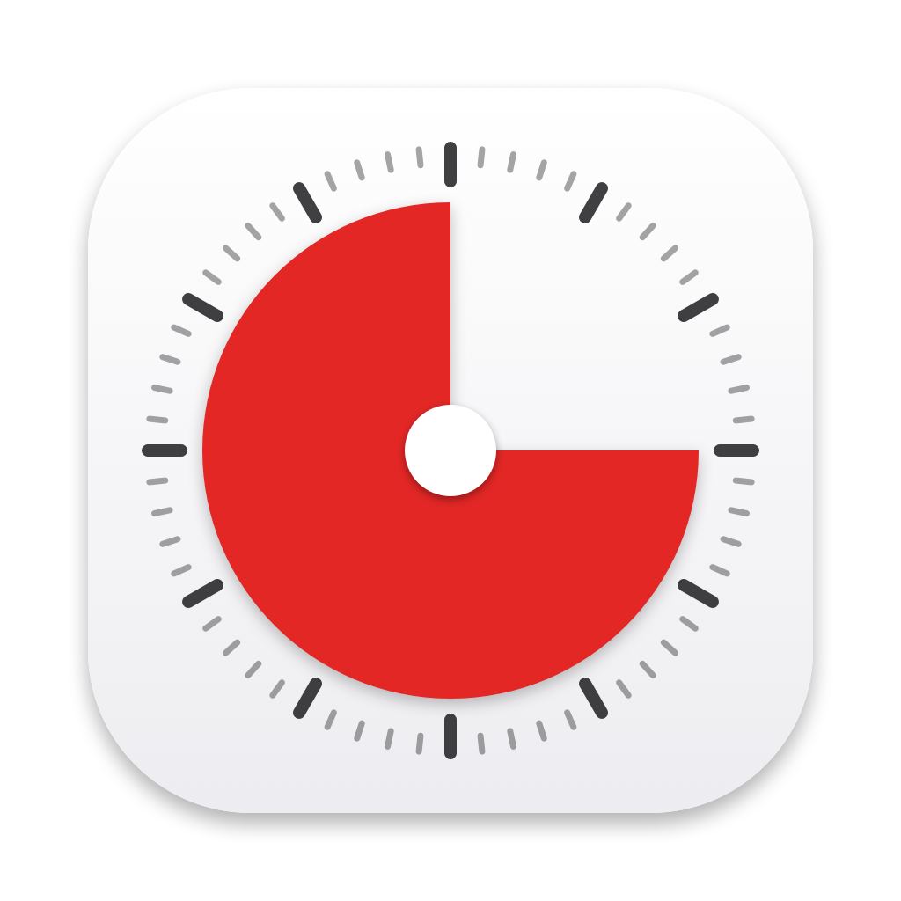

<p align="center">
  
</p>

# HourPie 🥧

A tiny macOS menu bar clock that shows the current hour draining away as a pie — like a [Time Timer](https://www.timetimer.com/), but for the clock hour.

At the top of every hour the pie is full. As the minutes pass it drains away, and at the next hour it refills. Forever, like a clock.


*The icon at 60, 45, 30, 15, and 5 minutes left in the hour.*

## Features

- Lives entirely in the menu bar — no Dock icon, no windows
- The coloured wedge is the time **left**; the empty part is the time gone
- Click it to see the exact time left in the hour (`42:17 left this hour`)
- Optional **Launch at Login**
- Zero dependencies, one Swift file, negligible CPU

## Settings

Everything is in the menu: click the pie → **Settings**.

| Setting | Options |
|---|---|
| **Direction** | Clockwise (default) or Anti-clockwise — which way the pie drains |
| **Colour** | Red (default), White, Blue, Green, or **Custom…** which opens the macOS colour picker |
| **Colour Coded Countdown** | Automatic colour by hour progress: green for the first 15 minutes, yellow for the next 15, red for the last 30 — applied to both the pie and the Show Time label. Picking a colour manually switches it back off |
| **Chime** | Off (default), or a system sound (Glass, Ping, Tink, Hero, Submarine) that rings at :15, :30 and :45, and rings twice at the top of the hour. Picking a sound previews it |
| **Show Border** | Outline ring around the pie, on by default |
| **Show Time** | Live `MM:SS` countdown next to the pie in the menu bar, off by default |

All settings are remembered across restarts.

## Install

### Download

Grab `HourPie.app.zip` from the [latest release](https://github.com/sami3d/HourPie/releases/latest), unzip, and drag `HourPie.app` into `/Applications`.

The app is ad-hoc signed (no Apple Developer account), so the first launch needs one extra step: **right-click the app → Open → Open**. Or clear the quarantine flag from Terminal:

```bash
xattr -d com.apple.quarantine /Applications/HourPie.app
```

### Build from source

Requires macOS 13+ and the Xcode command line tools.

```bash
git clone https://github.com/sami3d/HourPie.git
cd HourPie
./build.sh            # or ./build.sh --universal for arm64 + x86_64
cp -R build/HourPie.app /Applications/
open /Applications/HourPie.app
```

## How it works

One Swift file. A one-second `Timer` computes the fraction of the hour remaining, redraws an 18 pt pie wedge in your chosen colour and direction with `NSBezierPath`, and sets it as the `NSStatusItem` image. That's the whole app.

## License

[MIT](LICENSE)
